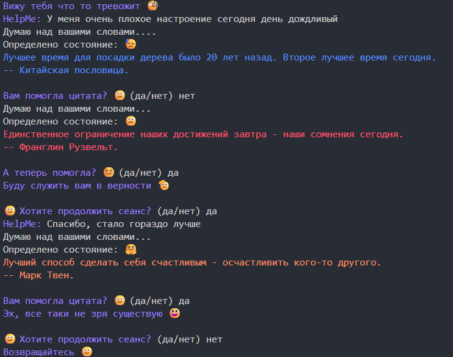
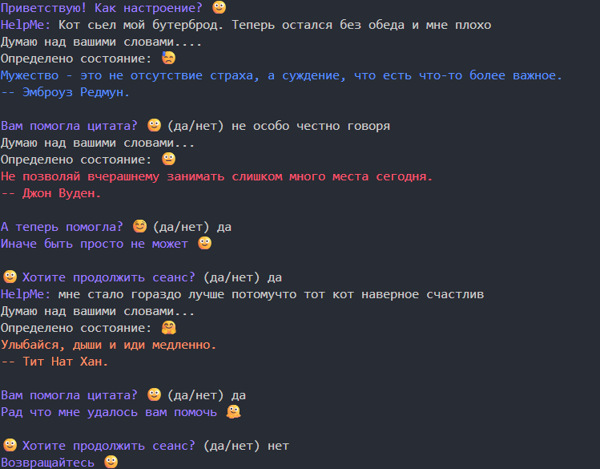

# 💙 HelpMe - Эмоциональный помощник

Умный эмоциональный помощник, который анализирует настроение пользователя 
и предоставляет психологическую поддержку через curated цитаты и эмпатический диалог.

## 📖 Оглавление
- [Возможности](#возможности)
- [Улучшения доступные в версии 2.0](#улучшения-доступные-в-версии-2.0:)
- [Установка и запуск](#установка)
- [Скриншоты](#скриншоты)

## 🎉 Возможности

- **🎭 Анализ эмоционального состояния** по тексту пользователя 
- **💫 Интелектуальный подбор цитат** из базы 150+ вдохновляющих высказываний
- **🔄️ Адаптивная поддержка** - разные стратегии для разных эмоций
- **📦 Модульная архитектура** - чистый и масштабируемый код
- **💬 Естественное взаимодействие** - интуитивный диалоговый интерфейс

## ⚙️ Улучшения доступные в версии 2.0:
- **🎨 Цветовая психология** подбор цветов по научным рекомендациям
- **🎡 Умная валидация** программа проверяет, помогла ли цитата
- **🖼️ Визуальные улучшения** colorama, эмодзи, паузы для драматизма
- **🤡 Чувство юмора** программа шутит и создает легкую атмосферу

## 🛠️ Установка и запуск

### Версия 2.0 (Рекомендуется)
```bash
cd version_02
python helpme_main.py
```

### Версия 1.0 (Историческая)
```bash
cd version_01
python helpme_main.py
```

## 📸 Скриншоты
### Версия 1.0:


### Версия 2.0:




