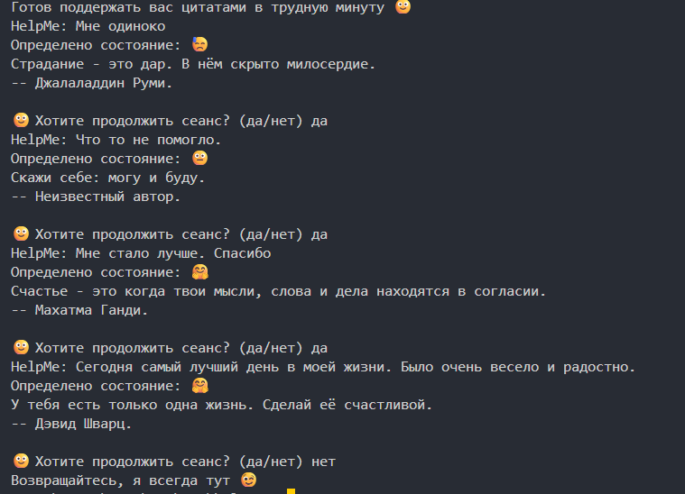
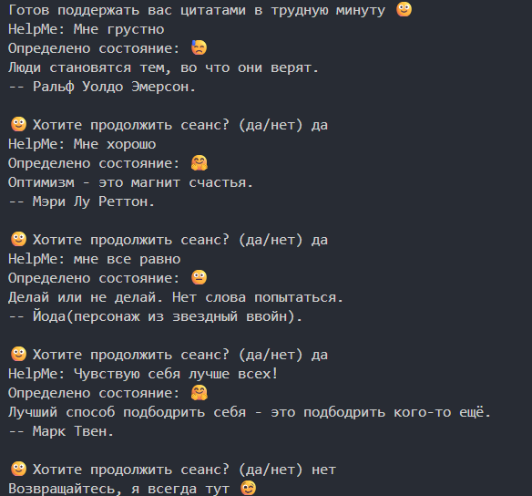

# 💙 HelpMe - Эмоциональный помощник

Умный эмоциональный помощник, который анализирует настроение пользователя 
и предоставляет психологическую поддержку через curated цитаты и эмпатический диалог.

## 📖 Оглавление
- [Возможности](#возможности)
- [Предварительные требования](#предварительные-требования)
- [Установка и запуск](#установка)
- [Скриншоты](#скриншоты)

## 🎉 Возможности

- **🎭 Анализ эмоционального состояния** по тексту пользователя 
- **💫 Интелектуальный подбор цитат** из базы 150+ вдохновляющих высказываний
- **🔄️ Адаптивная поддержка** - разные стратегии для разных эмоций
- **📦 Модульная архитектура** - чистый и масштабируемый код
- **💬 Естественное взаимодействие** - интуитивный диалоговый интерфейс

# Быстрый старт

## Предварительные требования
- Python 3.8 или выше

## Установка и запуск
```bash
cd version_01
python helpme_main.py
```

## 📸 Скриншоты




